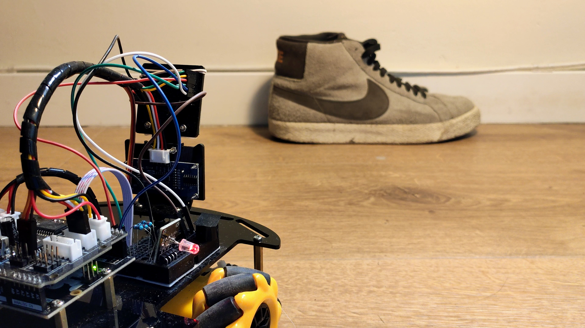
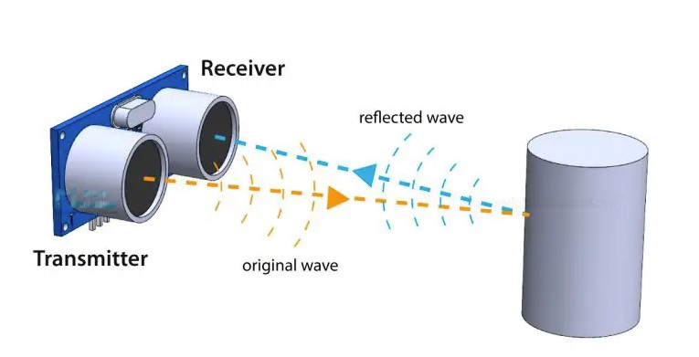
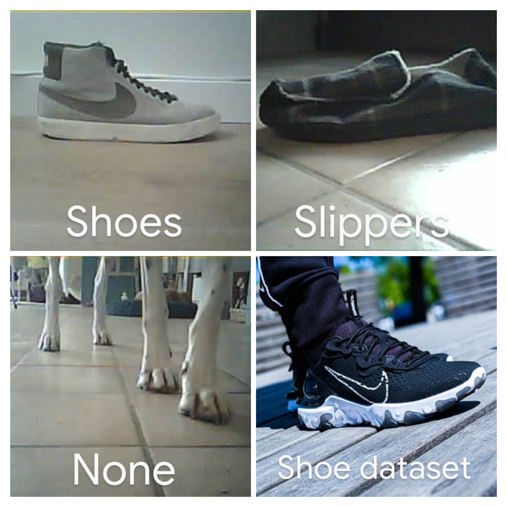
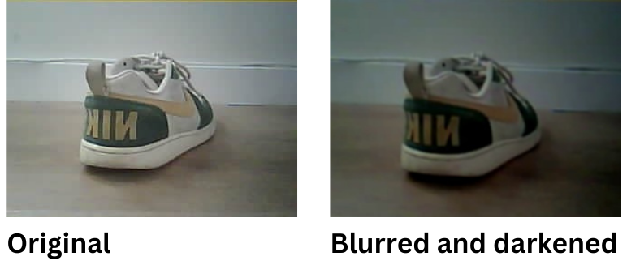
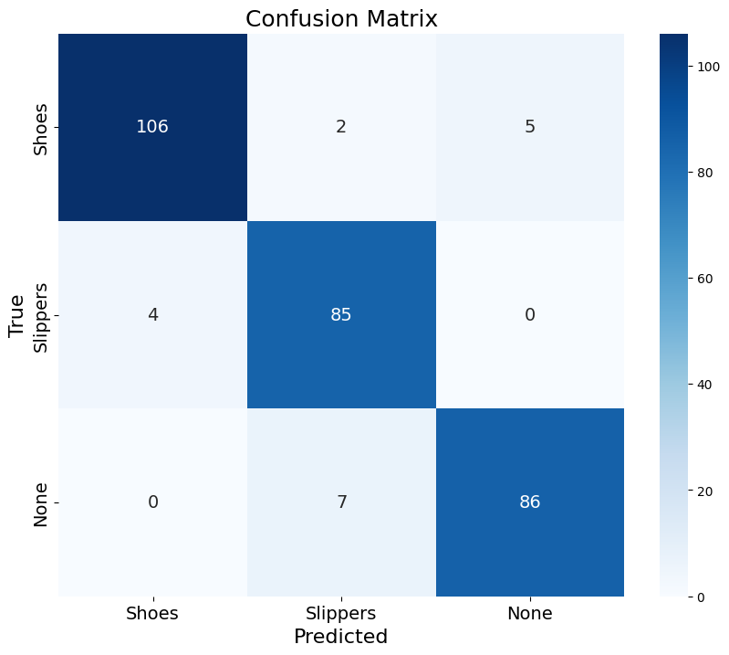

# Shoebot


## Project Overview

We wanted to experiment with a low-budget mobile robot with machine-learning (ML) capabilities. We decided on a project in which the robot's mission is to detect when someone enters the house wearing shoes, and respond accordingly, helping maintain a shoe-free space\! The robot uses ML to distinguish between two categories: **shoes** (forbidden) and **bare feet, socks, or slippers** (allowed). 

This article walks through the project’s key components and the challenges we encountered along the way. The full code and a sample dataset are available on our Github.

Check out the [demos](#Demos) at the end\!


## Hardware

In our setup, two boards control one robot, dividing responsibilities between movement and camera control:

1. **Arduino UNO**:  
   * Controls the robot’s movement, including the motors and the ultrasonic sensor for obstacle detection.  
2. **ESP32 CAM**:  
   * Handles the camera, capturing images, and sending them over Wi-Fi to a server for processing.

We used a laptop running a simple Flask server to process images sent from the ESP32 CAM and perform image classification, using a lightweight machine-learning model. No powerful hardware was required for real-time classification — our standard laptop (without a GPU) managed just fine on a CPU alone. For model training, we used [Google Colab](https://colab.google/) with GPU support.


### Complete Gear List

* Arduino UNO (clone)  
* Motor shield  
* ESP32 CAM (chip \+ camera)  
* Car chassis  
* 4 wheels \+ 4 motors  
* Servo motor  
* Ultrasonic sensor  
* Cables  
* Buzzer  
* RGB led  
* Resistors

### Building the robot

<table>
  <tr>
    <td></td>
    <td></td>
  </tr>
  <tr>
    <td></td>
    <td></td>
  </tr>
</table>

## Movement Control: Arduino UNO

Our robot uses **4 motors** connected to **4 Mecanum wheels**. Mecanum wheels are special in that they allow the robot to move in any direction by controlling the rotation of each wheel individually. The Arduino controls these motors by sending **LOW/HIGH voltage signals**, determining whether a motor moves forward or backward.

To break it down:

* Each Mecanum wheel can move forward or backward, and by coordinating the movements of all 4 wheels, the robot can move not only forward and backward, but also sideways and diagonally.  
* In the Arduino code, we assign an 8-bit binary value to each possible direction. Every two bits correspond to the status of one motor. For example:  
  * The **top-right motor** is represented by the two highest bits: `10` means the wheel moves forward, while `01` means backward.  
  * By combining these binary values, we can define specific directions for the robot to move in.

**Note:** Ideally, a joystick would be the best way to control a robot with Mecanum wheels, allowing full freedom of movement in any direction. However, since our robot moves autonomously, we’ve limited its directional options to make it more predictable.  
(Read more: [How to Make Mecanum Wheel Robot and Program It Correctly](https://www.instructables.com/How-to-Make-Mecanum-Wheel-Robot-and-Program-It-Cor/)) 


### Autonomous Movement

The robot’s movement algorithm is simple yet effective. Here’s how it works:

1. **Move Forward**: By default, the robot continuously moves forward until an obstacle is detected.  
2. **Obstacle Detection**: If the **ultrasonic sensor** detects an object closer than the defined minimum safe distance, the robot stops.  
3. **Decision Making**: When an obstacle is encountered, the robot “looks” both left and right by rotating the ultrasonic sensor mounted on a Servo motor, and measures the distances to obstacles in both directions.  
4. **Turning**: The robot turns towards the direction with the larger clearance.

To prevent the robot from getting stuck in tight corners, we also added a **reverse function**. If obstacles are detected on both sides, the robot reverses before checking its surroundings again. After reversing, the robot doesn’t move forward immediately; it turns to avoid being trapped in a loop.

The obstacle detection is carried out using an **ultrasonic sensor**, which measures distances via ultrasonic sound waves. The sensor emits a pulse that bounces off an obstacle and returns to the sensor. By calculating the time it takes for the pulse to return, and using the known speed of sound, the distance can be determined.

In our case, an object is considered an obstacle if it is less than 40 cm away from the robot. Here's the formula used to compute the distance:

$Distance = \frac{1}{2}  (timeInMicroseconds \cdot 0.034)$

This formula takes into account the speed of sound (340 m/s or 0.034 cm/μm), with the pulse traveling to the object and back.



Source: [Ultrasonic Sensor HC-SR04 and Arduino \- Complete Guide](https://howtomechatronics.com/tutorials/arduino/ultrasonic-sensor-hc-sr04/)


https://github.com/user-attachments/assets/2f77e3ec-e54d-49d1-a996-a4c02aa44318


### Communication with ESP32

For seamless operation, the Arduino UNO and ESP32 CAM need to exchange information continuously. The UNO notifies the ESP32 when an obstacle is detected, prompting it to take a picture for classification. After processing, the ESP32 sends its classification decision back to the UNO to inform the robot’s next steps.

They communicate using **RX-TX serial communication**, a method for back-and-forth data exchange. A serial bus consists of just two wires: one for sending data (TX) and another for receiving data (RX). Each device must have two dedicated pins, RX (receiver) and TX (transmitter), which are connected in a crossover configuration (the TX of one device to the RX of the other).


Source: [Serial Communication \- SparkFun Learn](https://learn.sparkfun.com/tutorials/serial-communication/wiring-and-hardware) 

Here’s how we set it up:

1. **Physical Connections**: The RX pin on the Arduino is connected to the TX pin on the ESP32, and vice versa.  
2. **Serial Communication Setup**: On both devices, we open a serial communication channel with the same baud rate (data transmission speed). For example:  
   ```c  
   Serial.begin(9600)  
   ```
3. **Sending Messages**: Once the connection is established, the Arduino can ‘print’ messages to the ESP32. As mentioned, in our project this communication was used to inform the ESP32 to take a picture whenever theArduino detected an obstacle.

**Note**: When the Arduino and ESP32 are connected via the RX-TX pins, you can't upload new code to either board, and the reset buttons do not function. To upload the code, you have to temporarily disconnect the serial connections.

## Image processing: ESP32 CAM

The ESP32 has two main tasks in this project: controlling the **camera** and communicating with the **server.**

### Camera Setup

We used the basic camera setup from the official Espressif example, “cameraWebServer.” Once the camera is initialized, capturing a picture is done with:
```c
camera_fb_t *fb = esp_camera_fb_get();
```
The image is stored in a framebuffer pointer (`fb`). After processing the image, we must free the pointer to avoid memory leaks:

```c
esp_camera_fb_return(fb);
```
### Connecting to Wi-Fi

Connecting the ESP32 to Wi-Fi sounds simple, but debugging Wi-Fi issues can be quite frustrating, especially when the problem isn’t in the code but in your network.

**Important note**: The ESP32 CAM **only** works on **2.4GHz Wi-Fi** networks. If you're using a dual-band router (with both 2.4GHz and 5GHz networks combined), this could prevent the ESP32 from connecting.

When we first tried to connect the ESP32 to our Wi-Fi, it kept failing and crashed with an uninformative "unknown error" code. This made it hard to pinpoint the issue since that error can also indicate a power problem or even a faulty ESP32 module. After spending quite some time troubleshooting, we discovered that the real issue was our Wi-Fi mesh system, which combined both 2.4GHz and 5GHz into one network. The solution: separating the two bands into distinct networks. After doing so, the ESP32 connected without any problem\!

### Communication with the server

We decided to use a **Python Flask server** to proccess images and an **HTTPClient** on the ESP32 to send data.

Here’s how we made the ESP32 communicate with the server:

1. **Capturing and Sending the Image**:  
   Once the ESP32 receives a command from the Arduino to take a picture, it creates an `HTTPClient` instance and connects to the server using its IP address. We had to send the image data in a specific format, combining a **header**, the **image data**, and a **tail** into a `uint8_t *body`. The server processes the image and responds with a prediction.  
2. **Processing the Server’s Response**:  
   Once the server classifies the image and sends back a result, the ESP32 processes this response. The result comes in the form of a **JSON document**, which is parsed to get the predicted class:  
    ```c
    DynamicJsonDocument doc(200); 
    DeserializationError error = deserializeJson(doc, response); 
    int prediction = doc["prediction"].as<int>(); // Extract the predicted class
    ```
3. **Reacting to the Prediction**:  
   Based on the server’s prediction, the ESP32 takes action with the buzzer and the lamp: either triggering the alarm (shoes), celebrating (slippers), or signaling that another prediction was made (all the rest).

Summary of ESP32 Communication Workflow

1. The **ESP32 camera captures an image**  
2. The **image is sent** to the server using `HTTPClient`
3. The server runs the image through an **image classification model**  
4. The **server sends the prediction** back to the ESP32  
5. The **ESP32 reacts** based on the prediction and sends instructions to the Arduino

## The Server

### Flask server

For the server, we kept things simple by using a **Python Flask server**. This server has 2 endpoints:

1. **GET /health** – This endpoint checks whether the server is running correctly.    
2. **POST /upload** – This endpoint handles the image uploads from the ESP32. Once an image is received, the server passes it through the model for classification, returning one of three classes: `{0, 1, 2}`. These numbers correspond to different categories, and the result is sent back to the ESP32 in the response.

### Image classification 

Our original plan was to use an integrated machine-learning model that could run locally on the ESP32, eliminating the need for an internet connection. This would have better mimicked a truly autonomous vehicle and saved us a lot of headaches with HTTP connection issues.  
However, **LiteRT** (previously known as [TensorFlow Lite](https://developers.googleblog.com/en/tensorflow-lite-is-now-litert/) ) currently has a very limited number of [supported devices](https://ai.google.dev/edge/litert/microcontrollers/overview#supported_platforms), and unfortunately, the ESP32 CAM wasn’t one of them.

Given that our **laptop lacks a GPU**, training a machine-learning model locally was not feasible. Instead, we leveraged [Google Colab](https://colab.research.google.com/)  to train the model, which allowed us to access GPU resources for faster processing. Once the model was trained, we deployed it locally to make predictions during real-time use.

The model was built using [Pytorch](https://pytorch.org/) , and we opted for fine-tuning a **pre-trained ResNet18 model**, which is lightweight enough to run efficiently on the laptop’s CPU.

#### Training the Model

We used a combination of images for training:

* **Photos captured by the ESP32** while it was stationary, to get a dataset that matches the low resolution and unique image quality of the ESP32 CAM.  
* **Additional images from the** [shoe dataset](https://www.kaggle.com/datasets/noobyogi0100/shoe-dataset)  to help the model generalize better and recognize different types of footwear. The dataset initially included full-body images of people wearing shoes, which were irrelevant to our project objectives. These images were manually removed.

The model was trained to classify images into **three categories**:

* **Shoes**  
* **Slippers**  
* **None** (anything that isn’t a shoe or slipper, in which case the robot takes no action).



Here are the training hyperparameters:
```python
batch_size = 32
num_epochs = 5
loss_fn = nn.CrossEntropyLoss()
optimizer = optim.Adam(model.parameters(), lr=1e-4, weight_decay=1e-4)
```

#### Data augmentation

One issue we encountered while training the model, was the difference in quality and size between the ESP32 images and the external **shoe dataset**. The ESP32 dataset was much smaller, its images were of lower resolution (320x240) and clarity and lacked variance in lighting conditions and angles.  To address these limitations, we augmented the dataset using [Albumentations](https://albumentations.ai/), generating more diverse training examples.

This augmentation process applies a series of transformations to each image to simulate real-world variations. To compensate for our dataset's limitations, we used the following transformations:

- `MotionBlur`: Simulates the blur caused by the robot’s movement.
- `RandomBrightnessContrast`: Randomly adjusts brightness and contrast to mimic varying lighting conditions.
- `Perspective`: Alters the perspective of objects to simulate seeing them from different angles.

Here’s an example of these transformations applied to one of the images:




Check out Albumentations’ [demos](https://huggingface.co/spaces/qubvel-hf/albumentations-demo) for a more detailed look at how these transforms work in practice.

We applied image augmentation of the images taken with the ESP32. The final dataset includes approximately 750, 1100, 500 images for Shoes, Slippers and None respectively. 
In consequence, even with the low-quality images from the ESP32, we achieved 93%$ F_1$ score or higher for each of the classes, as measured over ~360 test set images.




## Final Outcome

The final test involved making predictions in **real time** as the robot moved. Although there were some challenges—such as a slight delay in image transmission—the system overall performed well. The robot successfully classified most objects and responded appropriately based on the predicted class.

Check out our videos to see the robot in action! The footage shows the robot navigating its environment, detecting obstacles, and making predictions on unseen objects.

### Demos
(Turn on the sound! The robot plays a tune depending on the prediction.)
#### Stationary
https://github.com/user-attachments/assets/376f7941-3cc9-4a6a-8ec9-b7eb11ac5895

#### Moving

https://github.com/user-attachments/assets/ed99cd87-311e-40ca-a37d-084b377aa266

https://github.com/user-attachments/assets/ed219a25-2deb-43ad-be14-4b306fc6a8bd

(More videos available in the [Videos](Videos) folder)

### Bloopers


